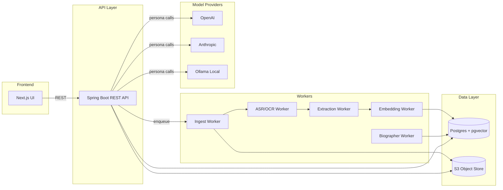
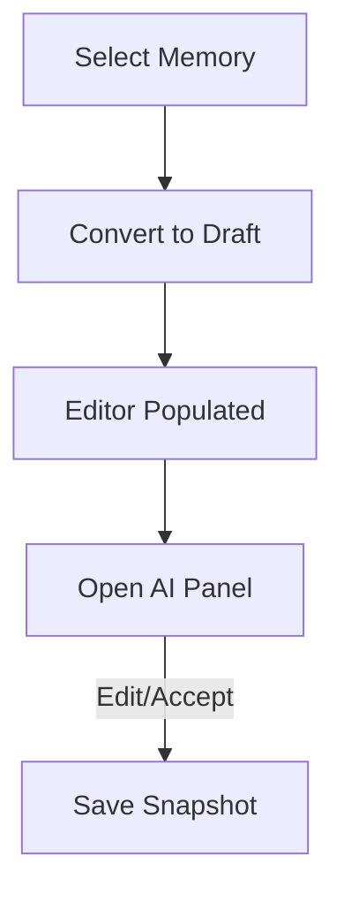
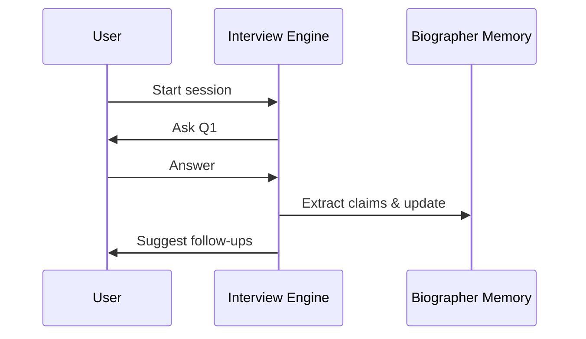
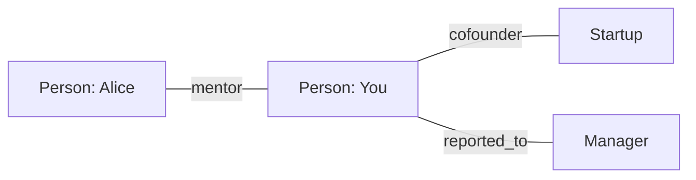

# Chronicle — Architecture & UX Design

Version: 0.1
Date: 2026-06-14

This document describes the product architecture, system design, domain model, database layout, UI architecture, screen wireframes, user flows, AI orchestration, API surface, MVP plan, and roadmap for Chronicle — an AI Biographer.

---

## 1. Product Architecture (Concise)
Chronicle is built as a modular, service-oriented platform with clear separation of concerns between capture, semantic memory, reasoning personas, retrieval, and presentation.

High-level modules (logical):
- chronicle-domain: core domain types and shared DTOs
- chronicle-memory: ingestion, preprocessing, storage of Subject Memory
- chronicle-biographer: Biographer Memory and reasoning state
- chronicle-interview: interview engine, session management
- chronicle-timeline: event extraction and timeline services
- chronicle-book: book generation, drafts, exports
- chronicle-rag: retrieval-augmented generation orchestration
- chronicle-ai-provider: model adapter, persona templates
- chronicle-api: REST API layer and DTOs
- chronicle-security: auth, consent, encryption, audit

Deployment units:
- API service (Spring Boot) — exposes REST endpoints
- Worker fleet (Kubernetes pods) — ingestion, ASR, OCR, embeddings, extraction
- Vector store (pgvector in Postgres or external index)
- Object store (S3-compatible) — media and raw artifacts
- Frontend (Next.js) — web UI + PWA capture
- Optional local model runner (Ollama) for local/offline privacy mode

Cross-cutting concerns:
- Provenance & audit: every inference stores model, prompt, sources
- Data portability: single export package with artifacts + vectors
- Privacy: per-user keys, optional client-side encryption
- Observability: metrics, traces, logs

## 2. System Architecture Diagram (Mermaid)

This shows the primary communication paths: frontend → API → workers + data layer + model providers.

## 3. Domain Model (Entities & Relationships)
High-level entities (with responsibilities):

- UserProfile (aggregate root)
  - id, user_name, email, settings, privacy_preferences, created_at

- Artifact
  - id, user_id, type (text/audio/photo/video/email), uri, metadata(jsonb), created_at, captured_at, uploaded_at
  - stores original files in object store; metadata includes source, EXIF, duration, language

- Memory (SubjectMemoryRecord)
  - id, user_id, artifact_ids[], summary, canonical_text, embedding(vector), entities[], topics[], confidence, created_at
  - fundamental unit used for retrieval

- Event
  - id, user_id, title, start_date, end_date, confidence, evidence_ids[], timeline_bucket, created_at
  - normalized event for timeline

- Theme
  - id, user_id, name, description, evidence_ids[], strength_score, first_seen, last_seen

- Claim
  - id, user_id, text, polarity, confidence, source_ids[], extracted_at

- Contradiction
  - id, user_id, claim_ids[], description, severity, resolved_flag, open_questions[]

- RelationshipNode
  - id, user_id, person_id, first_mentioned, last_mentioned, role_tags[], sentiment_over_time

- BiographerNote
  - id, user_id, type (observation/hypothesis/question/plan), text, confidence, related_ids[], created_at

- InterviewSession
  - id, user_id, persona, questions[], answers[], followups[], started_at, ended_at

- BookDraft
  - id, user_id, type (memoir, manifesto), chapters[], voice_profile_id, persona_weights, status

Collections and maps will be represented via JSONB in the DB for flexibility.

## 4. Database Design (ERD & Tables)
Use PostgreSQL with `pgvector` extension. Store large binaries in object store and reference from `artifacts`.

Core tables (DDL-style descriptions):

- users
  - id UUID PK
  - name TEXT
  - email TEXT UNIQUE
  - settings JSONB
  - created_at TIMESTAMP

- artifacts
  - id UUID PK
  - user_id UUID FK -> users
  - type TEXT
  - uri TEXT
  - metadata JSONB
  - captured_at TIMESTAMP
  - uploaded_at TIMESTAMP

- memories
  - id UUID PK
  - user_id UUID FK
  - artifact_ids UUID[]
  - summary TEXT
  - canonical_text TEXT
  - embedding REAL[] or VECTOR (pgvector)
  - entities JSONB
  - topics JSONB
  - confidence FLOAT
  - created_at TIMESTAMP

- events
  - id UUID PK
  - user_id UUID FK
  - title TEXT
  - start_date DATE
  - end_date DATE
  - evidence_ids UUID[]
  - confidence FLOAT
  - timeline_bucket TEXT
  - created_at TIMESTAMP

- themes
  - id UUID PK
  - user_id UUID FK
  - name TEXT
  - description TEXT
  - evidence_ids UUID[]
  - strength_score FLOAT
  - created_at TIMESTAMP

- claims
  - id UUID PK
  - user_id UUID FK
  - text TEXT
  - polarity TEXT
  - confidence FLOAT
  - source_ids UUID[]
  - embedding VECTOR
  - created_at TIMESTAMP

- contradictions
  - id UUID PK
  - user_id UUID FK
  - claim_ids UUID[]
  - description TEXT
  - severity INT
  - resolved BOOLEAN
  - open_questions JSONB
  - created_at TIMESTAMP

- biographer_notes
  - id UUID PK
  - user_id UUID FK
  - type TEXT
  - text TEXT
  - confidence FLOAT
  - related_ids UUID[]
  - created_at TIMESTAMP

- interview_sessions
  - id UUID PK
  - user_id UUID FK
  - persona TEXT
  - questions JSONB
  - answers JSONB
  - followups JSONB
  - started_at TIMESTAMP
  - ended_at TIMESTAMP

- book_drafts
  - id UUID PK
  - user_id UUID FK
  - type TEXT
  - chapters JSONB
  - voice_profile_id UUID
  - persona_weights JSONB
  - status TEXT
  - created_at TIMESTAMP

Indexes & strategies
- Use GIN indexes on JSONB fields frequently queried (metadata, entities).
- Create `pgvector` vector index for `memories.embedding` and `claims.embedding`.
- Time-series partitioning for `artifacts` and `memories` if user data grows large.

Aggregate roots & boundaries
- `UserProfile` is the root for all user-scoped data (multi-tenant isolation by user_id).
- `Memory` and `Event` aggregates handle retrieval and timeline concerns.
- `BiographerNote` and `Contradiction` are owned by the biographer module and can be promoted to user-validated events or themes.

## 5. UI Architecture & Navigation
Design: left-side vertical navigation (desktop-first) similar to VS Code/Copilot.

Primary navigation order (left):
- Home
- Writing Studio
- Interviews
- Timeline
- Themes
- Relationships
- Biographer Notebook
- Books
- Manifesto
- Legacy
- Settings

Top bar: global search (semantic), quick-capture (text/photo/voice), user menu.

Right panel: contextual AI side panel used in Writing Studio and Interview Console; can be collapsed.

Responsiveness: desktop-first; PWA capture for mobile quick-capture flows.

## 6. Screen Designs & Wireframes (Layout + Behavior)
Wireframes are textual + simple Mermaid diagrams where helpful.

### Screen 1 — Writing Studio
Purpose: collaborative long-form writing and iterative drafting with AI personas.

Layout:
- Left: `Document Tree` (chapters, drafts)
- Center: `Rich Text Editor` (full page) with inline comments and provenance markers
- Right: `AI Side Panel` with persona tabs (Editor, Philosopher, Historian, Skeptic)
- Bottom toolbar: version control (snapshots), voice-profile selector, persona weight sliders

AI Side Panel contents:
- Persona selector (tab per persona)
- Suggestions: inline rewrite suggestions, expand, shorten, ask follow-up questions
- Evidence: list of supporting artifacts and citations
- Action buttons: "Convert Memory → Chapter", "Generate Chapter Outline", "Polish Voice"

User flows:
- Select memory or event → click "Convert to Draft" → editor populates draft with provenance links.
- Use `Skeptic` persona to highlight contradictions; produces a private `BiographerNote` entry.

Mermaid outline (document flow):

### Screen 2 — Interview Console
Purpose: structured, adaptive interviewing sessions with persona-driven questions.

Layout:
- Left: `Session Queue` (active, scheduled, history)
- Center: `Active Interview` (question display + answer input area — text/voice)
- Right: `Context & Evidence` (memories, events, person nodes related to the topic)
- Top: persona selector and tone control (gentle/probing/skeptical)
- Bottom: follow-up queue builder (AI suggests follow-ups marked priority)

Workflow:
1. Start session (select persona + context)
2. AI asks prioritized question
3. User answers (text or voice). If voice selected, ASR transcribes and attaches artifact.
4. System extracts claims, updates Subject Memory and Biographer Memory, enqueues follow-ups.
5. Interview session saved; follow-ups scheduled.

Mermaid flow:

### Screen 3 — Timeline
Purpose: visual life history and evidence browsing.

Views:
- Decade view (zoomed out)
- Life-phase view (career, family, travel)
- Event cluster view (projects, relationships)

Interactions:
- Click an event → detail pane shows artifacts, claims, related themes, contradictions
- Drag to merge events / resolve duplicates (user-driven canonicalization)
- Filter by theme, person, confidence
- Gap detection highlights low-evidence ranges; "Ask Question" quick action to open Interview Console

### Screen 4 — Themes
Purpose: detect and present recurring themes with evidence.

Theme card contents:
- Title, short description
- Timeline sparkline showing theme strength over time
- Confidence score
- Representative memories (3–5) with excerpts
- Buttons: "Explore Stories", "Ask to Expand", "Create Chapter"

Interactions:
- Click "Explore Stories" → story feed filtered by theme
- Click "Create Chapter" → opens Writing Studio with pre-populated outline

### Screen 5 — Biographer Notebook
Purpose: private working notes belonging to the AI biographer.

Layout:
- Top: filtering (Observations / Hypotheses / Questions / Plans)
- Center list: notes with confidence badge and linked evidence previews
- Right pane: note detail with edit, escalate-to-user, link-to-event buttons

Behavior:
- Biographer notes can be private (AI-only) or shared with user when confidence > threshold
- User can promote a note to an event, theme, or ask follow-up questions

Tone & UI cues:
- Notebook should feel like a research notebook — typewriter fonts for notes, soft-paper background option, non-judgmental language

### Screen 6 — Relationship Graph
Purpose: visualize people & influence networks.

Features:
- Force-directed graph showing people, organizations, projects as nodes
- Node sizing by narrative importance, edge thickness by interaction frequency
- Clicking node opens detail (first mention, role, representative memories)
- Timeline slider to animate relationships over time

Mermaid placeholder for graph interactions:

### Screen 7 — Book Reader
Purpose: read generated books with evidence and export options.

Layout:
- Left: chapter navigation
- Center: formatted text with inline citation popovers
- Right: evidence sidebar (linked artifacts used in the chapter)
- Actions: "Export PDF", "Export EPUB", "Request Revision", "Lock Chapter"

Citations & provenance:
- Show artifact snippets on hover/click with link to original artifact
- Include model & prompt provenance in export metadata

### Screen 8 — Legacy Dashboard
Purpose: measure lifecycle completeness and progress toward legacy goals.

Metrics & cards:
- Stories Captured: count of artifacts & canonicalized memories
- Themes Discovered: number and completeness scores
- Lessons Extracted: count and priority
- Open Questions: unresolved high-priority biographer questions
- Book Completion: percent complete by draft stage

Actionables:
- "Schedule Interview to fill gaps"
- "Run contradiction sweep"

## 7. User Flows (High-level)

Flow A — Capture to Chapter
1. Quick-capture (voice) → artifact uploaded
2. ASR worker transcribes → memory created and embedded
3. Timeline engine associates event → theme detection runs
4. User clicks memory → "Convert to chapter" in Writing Studio
5. Editor (and voices) suggest expansions → user edits → snapshot saved
6. BookDraft updated

Flow B — Contradiction Discovery
1. Regular contradiction-pass runs via Biographer Worker
2. Contradiction created with severity and open questions
3. Appears in Biographer Notebook and Contradiction Review
4. User invited (gentle prompt) to clarify via Interview Console
5. Post-answer: update claims, mark resolved or update contradiction

Flow C — Generate Memoir Draft
1. User selects date ranges and persona weights
2. Book Engine collects timeline nodes, theme summaries, and biographer notes
3. RAG orchestration builds context bundles per chapter
4. LLM generates chapter drafts with provenance
5. Skeptic persona runs verification; issues flagged for user review

## 8. AI Architecture (Personas & Orchestration)

Persona components:
- Prompt Templates: curated templates per persona with controlled chain-of-thought guidance and output schema
- Post-processors: extraction rules to normalize claims, confidence scores, and provenance
- Verifier: entailment/contradiction model to rate support

Persona examples & roles:
- Historian: temporal extraction, event normalization, strict fact focus
- Interviewer: question generator, follow-up prioritizer
- Skeptic: contradiction detector and verifier
- Editor: voice polishing, brevity, clarity
- Philosopher: principle extraction, abstracting lessons
- Biographer: narrative assembly and synthesis

Orchestration patterns:
- Retrieve-Context: query vector store for top-N memories, include top biographer notes, include event window
- Assemble-Prompt: include persona instruction, voiceProfile sample, context bundle, and explicit generation constraints (max claims, cite top-3 artifacts)
- Generate-Draft: call LLM
- Verify-Pass: run Skeptic persona to cross-check claims and add contradictions/notes
- Persist: save draft with provenance and link artifacts used

Memory usage in prompts:
- Include summarized subject-memory snippets (3–5) with dates and artifact IDs
- Include biographer-notes flagged as "reasoning" (observations/hypotheses) as prompts for deeper questioning
- Always request source citations and confidence estimates

Model routing and fallback
- Default: cloud LLM (OpenAI)
- Sensitive/private mode: local Ollama models if available
- Failover: switch to smaller local models for short tasks if cloud unavailable

## 9. Contradiction Detection & Resolution Strategy
- Claim extraction: use span extraction and relation mapping from artifacts
- Semantic conflict detection: pairwise entailment/contradiction via specialized models
- Severity scoring: severity = f(confidence_of_claims, recency, narrative_impact)
- UI handling: show paired claims, supporting artifacts, and suggest interview prompts
- Resolution: user answers can update claim confidences or create reconciled statements; biographer updates its notes

## 10. RAG & Retrieval Strategy
- Embeddings: per-memory and per-claim embeddings stored in `pgvector`.
- Hybrid retrieval: combine vector similarity + temporal filters + BM25 on canonical_text
- Context window: limit to N tokens; prioritize most-relevant memory + newest evidence
- Citation policy: require discrete artifact citations for any factual claim

## 11. API Design (Top-level REST Endpoints)

Authentication: OAuth2 / OIDC, token-based sessions

Core endpoints (examples):

- POST /v1/artifacts
  - Upload media or text
  - Request: multipart/form-data with `type`, `captured_at`, `metadata`
  - Response: `artifactId`, status

- GET /v1/timeline
  - Query params: `start`, `end`, `zoom=decade|phase|detail`, `themeId`, `personId`
  - Response: timeline nodes with eventId, title, dates, evidence snippet

- POST /v1/memories/search
  - Body: { queryText, persona?, topK?, filters? }
  - Response: list of memories with `summary`, `artifactIds`, `score`

- POST /v1/query
  - Body: { queryText, persona, voiceProfileId, provenance=true/false }
  - Response: { answer, sources:[{artifactId, snippet}], modelMeta }

- POST /v1/interviews/start
  - Body: { persona, contextIds[], tone, scheduledAt? }
  - Response: { sessionId, firstQuestion }

- POST /v1/interviews/:id/answer
  - Body: { answerText, attachments? }
  - Response: { nextQuestion, updatedNotes }

- GET /v1/contradictions
  - Query params: `severity`, `resolved` filters
  - Response: contradictions with linked claims and evidence

- POST /v1/books/draft
  - Body: { type, personaWeights, ranges, includeThemes[] }
  - Response: { draftId, status }

Pagination & filtering
- Use standard `?page=`, `?per_page=` and cursor-based `nextCursor` for large sets
- Filtering via JSONPath in query body for complex filters

## 12. Security & Privacy
- Per-user encryption keys for optional client-side encryption
- Role-based access for shared family views
- Consent & sharing: explicit operations for granting posthumous access
- Audit trail for model calls and exports

## 13. MVP Plan (90-day focused)
Goals: enable capture, timeline, basic retrieval, interview sessions, and simple book draft generation.

Sprint 0 (Weeks 0–2):
- Project setup, infra, Postgres + pgvector, object store
- API & Next.js skeleton
- LLM adapter + small personas templates

Sprint 1 (Weeks 3–6):
- Text artifact ingestion, embeddings, simple search endpoint
- Timeline extraction (text-only)
- Basic Writing Studio with Convert Memory → Draft

Sprint 2 (Weeks 7–12):
- ASR integration for voice capture
- Interview Console basic flow (question → record answer → extract)
- Book Draft generator (chronological, text-only) with provenance

Success metrics for MVP:
- Ingestion latency < 30s
- Retrieval accuracy: user-rated 4/5 on sample interviews
- Book draft generation within 60s for small ranges

## 14. Future Roadmap (beyond MVP)
- VoiceProfile fine-tuning and private model adaptation
- Relationship weaving and multi-user timelines
- Local-first private mode (Ollama) and encrypted on-device storage
- Advanced editor features: persona mixing with sliders, automated chapter scheduling
- Publisher integrations: print-on-demand, legacy vaults

## 15. Deliverables & Next Steps
I've added this design doc; next I can produce any of the following (pick one):
- A detailed OpenAPI specification file for the API endpoints
- A full ERD diagram and DDL SQL for Postgres + `pgvector`
- Persona prompt templates and prompt engineering guidelines
- High-fidelity UI mockups (Figma-ready specs)

---

Document created: docs/ARCHITECTURE_AND_UX.md
