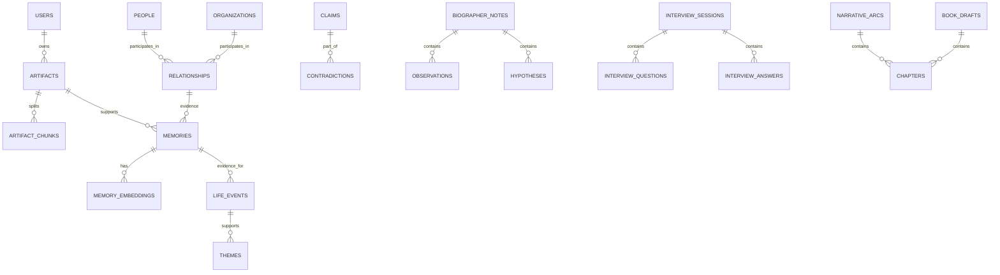

# Chronicle — Database Design (PostgreSQL + pgvector)

Version: 0.1
Date: 2026-06-14

This document defines the database design for Chronicle focused on PostgreSQL with the pgvector extension for semantic search. It models four independent memory systems: Subject Memory, Biographer Memory, Relationship Memory, and Narrative Memory.

Goals and rules
- Use PostgreSQL as the authoritative store; use an S3-compatible object store for raw media.
- Use `pgvector` (`vector` type) for embeddings and semantic search.
- Original artifacts are immutable and must never be overwritten.
- Interpretations (observations, hypotheses, contradictions, themes, etc.) must always include provenance linking back to evidence (artifact ids and snippets).
- Subject Memory and Biographer Memory are separate schemas/tables and explicitly linked via provenance references.
- Support soft deletes and audit fields.
- MVP supports a single-subject (single-user) mode; schema is compatible with future multi-subject/family mode.

Contents
- ERD (Mermaid)
- Table list and purpose
- PostgreSQL DDL (Flyway-friendly examples)
- pgvector column usage and index suggestions
- Indexes and foreign keys
- JSONB metadata and provenance model
- Audit fields and soft-delete strategy
- Confidence scoring
- MVP tables vs Future tables

---

## ERD (Mermaid)



Notes: the ERD above is a high-level view; refer to table DDL below for detailed FK relationships.

---

## Table list (by memory system)

Subject Memory (factual)
- `users`
- `artifacts` (raw uploads; immutable)
- `artifact_chunks` (text/audio transcript segments, optional embeddable unit)
- `memories` (canonicalized subject memory items)
- `memory_embeddings` (embeddings for `memories` or chunk-level embeddings)
- `life_events` (timeline nodes that reference memories/artifacts)

Biographer Memory (interpretive)
- `biographer_notes` (root container for observations/hypotheses/questions/plans)
- `observations`
- `hypotheses`
- `open_questions`
- `investigation_plans`
- `claims` (extracted assertions)
- `contradictions`

Relationship Memory
- `people`
- `organizations`
- `places`
- `relationships` (edges linking people/orgs/places and their roles/times)

Narrative Memory
- `themes`
- `narrative_arcs`
- `chapters`
- `book_drafts`
- `manifesto_principles`

Cross-cutting
- `interview_sessions`, `interview_questions`, `interview_answers`
- `provenance` (auxiliary table or embedded JSONB in each interpretive row)

---

## Naming & Migration Conventions

- Use snake_case for table and column names to match typical Spring Boot + JPA defaults (and ease Flyway migrations).
- Flyway migration file example names: `V1__create_core_tables.sql`, `V2__add_biographer_tables.sql`.
- Use UUID primary keys (Postgres `uuid` type) for stability across distributed systems.

---

## PostgreSQL DDL (Flyway-style snippets)

Note: these are example DDL blocks; combine them into a migration file per Flyway.

1) Ensure extensions

```sql
-- V1__extensions.sql
CREATE EXTENSION IF NOT EXISTS "uuid-ossp";
CREATE EXTENSION IF NOT EXISTS vector; -- pgvector
```

2) `users`

```sql
CREATE TABLE users (
  id uuid PRIMARY KEY DEFAULT uuid_generate_v4(),
  username text NOT NULL,
  email text UNIQUE,
  settings jsonb DEFAULT '{}'::jsonb,
  created_at timestamptz NOT NULL DEFAULT now(),
  updated_at timestamptz,
  deleted_at timestamptz,
  deleted boolean NOT NULL DEFAULT false
);
CREATE INDEX idx_users_email ON users(email);
```

3) `artifacts` (immutable originals)

```sql
CREATE TABLE artifacts (
  id uuid PRIMARY KEY DEFAULT uuid_generate_v4(),
  user_id uuid NOT NULL REFERENCES users(id) ON DELETE CASCADE,
  source_type text NOT NULL, -- 'upload','email','social','import'
  media_type text NOT NULL, -- 'text','audio','image','video','email'
  uri text NOT NULL, -- object-store pointer (S3 URI)
  metadata jsonb DEFAULT '{}'::jsonb, -- exif, duration, language, source id
  immutable boolean NOT NULL DEFAULT true,
  created_at timestamptz NOT NULL DEFAULT now(),
  uploaded_at timestamptz,
  checksum text,
  deleted_at timestamptz,
  deleted boolean NOT NULL DEFAULT false
);
CREATE INDEX idx_artifacts_user ON artifacts(user_id);
```

Design note: `artifacts` are append-only. To correct an artifact, ingest a new artifact and mark previous as superseded via metadata or a linkage table.

4) `artifact_chunks` (text/transcript chunks)

```sql
CREATE TABLE artifact_chunks (
  id uuid PRIMARY KEY DEFAULT uuid_generate_v4(),
  artifact_id uuid NOT NULL REFERENCES artifacts(id) ON DELETE CASCADE,
  chunk_index int NOT NULL,
  text text,
  start_offset_ms int,
  end_offset_ms int,
  metadata jsonb DEFAULT '{}'::jsonb,
  embedding vector(1536),
  created_at timestamptz NOT NULL DEFAULT now()
);
CREATE INDEX idx_artifact_chunks_artifact ON artifact_chunks(artifact_id);
CREATE INDEX idx_artifact_chunks_embedding ON artifact_chunks USING ivfflat (embedding) WITH (lists = 100);
```

Notes: Use chunk-level embeddings for long artifacts (audio, long documents) to support granular retrieval.

5) `memories` (subject memory canonical records)

```sql
CREATE TABLE memories (
  id uuid PRIMARY KEY DEFAULT uuid_generate_v4(),
  user_id uuid NOT NULL REFERENCES users(id) ON DELETE CASCADE,
  artifact_ids uuid[] DEFAULT '{}', -- origin artifact(s)
  title text,
  canonical_text text,
  summary text,
  top_entities jsonb,
  topics jsonb,
  confidence float DEFAULT 0.0,
  provenance jsonb DEFAULT '{}'::jsonb, -- structured provenance (see model below)
  embedding vector(1536),
  created_at timestamptz NOT NULL DEFAULT now(),
  updated_at timestamptz,
  deleted_at timestamptz,
  deleted boolean NOT NULL DEFAULT false
);
CREATE INDEX idx_memories_user ON memories(user_id);
CREATE INDEX idx_memories_embedding ON memories USING ivfflat (embedding) WITH (lists = 100);
CREATE INDEX idx_memories_topics ON memories USING gin (topics jsonb_path_ops);
```

6) `memory_embeddings` (separate store if you prefer chunked indexing)

```sql
CREATE TABLE memory_embeddings (
  id uuid PRIMARY KEY DEFAULT uuid_generate_v4(),
  memory_id uuid NOT NULL REFERENCES memories(id) ON DELETE CASCADE,
  chunk_id uuid, -- optional link to artifact_chunks
  embedding vector(1536) NOT NULL,
  created_at timestamptz NOT NULL DEFAULT now()
);
CREATE INDEX idx_memory_embeddings_memory ON memory_embeddings(memory_id);
CREATE INDEX idx_memory_embeddings_embedding ON memory_embeddings USING ivfflat (embedding) WITH (lists = 200);
```

7) `life_events` (timeline nodes)

```sql
CREATE TABLE life_events (
  id uuid PRIMARY KEY DEFAULT uuid_generate_v4(),
  user_id uuid NOT NULL REFERENCES users(id) ON DELETE CASCADE,
  title text NOT NULL,
  start_date date,
  end_date date,
  evidence_ids uuid[] DEFAULT '{}', -- refs to memories/artifacts
  confidence float DEFAULT 0.0,
  metadata jsonb DEFAULT '{}'::jsonb,
  created_at timestamptz NOT NULL DEFAULT now(),
  updated_at timestamptz,
  deleted_at timestamptz,
  deleted boolean NOT NULL DEFAULT false
);
CREATE INDEX idx_life_events_user_dates ON life_events(user_id, start_date, end_date);
```

8) Relationship Memory tables: `people`, `organizations`, `places`, `relationships`

```sql
CREATE TABLE people (
  id uuid PRIMARY KEY DEFAULT uuid_generate_v4(),
  user_id uuid NOT NULL REFERENCES users(id) ON DELETE CASCADE,
  display_name text,
  aliases text[],
  metadata jsonb DEFAULT '{}'::jsonb,
  first_mentioned timestamptz,
  last_mentioned timestamptz,
  narrative_importance float DEFAULT 0.0,
  created_at timestamptz NOT NULL DEFAULT now(),
  deleted_at timestamptz,
  deleted boolean NOT NULL DEFAULT false
);

CREATE TABLE organizations (
  id uuid PRIMARY KEY DEFAULT uuid_generate_v4(),
  user_id uuid NOT NULL REFERENCES users(id) ON DELETE CASCADE,
  name text,
  metadata jsonb DEFAULT '{}'::jsonb,
  created_at timestamptz NOT NULL DEFAULT now()
);

CREATE TABLE places (
  id uuid PRIMARY KEY DEFAULT uuid_generate_v4(),
  user_id uuid NOT NULL REFERENCES users(id) ON DELETE CASCADE,
  name text,
  geo jsonb DEFAULT '{}'::jsonb,
  metadata jsonb DEFAULT '{}'::jsonb,
  created_at timestamptz NOT NULL DEFAULT now()
);

CREATE TABLE relationships (
  id uuid PRIMARY KEY DEFAULT uuid_generate_v4(),
  user_id uuid NOT NULL REFERENCES users(id) ON DELETE CASCADE,
  subject_person_id uuid REFERENCES people(id) ON DELETE CASCADE,
  object_person_id uuid REFERENCES people(id) ON DELETE CASCADE,
  organization_id uuid REFERENCES organizations(id),
  role text,
  start_date date,
  end_date date,
  evidence_ids uuid[] DEFAULT '{}',
  metadata jsonb DEFAULT '{}'::jsonb,
  created_at timestamptz NOT NULL DEFAULT now()
);
CREATE INDEX idx_relationships_subject ON relationships(subject_person_id);
CREATE INDEX idx_relationships_object ON relationships(object_person_id);
```

9) Theme and Narrative tables

```sql
CREATE TABLE themes (
  id uuid PRIMARY KEY DEFAULT uuid_generate_v4(),
  user_id uuid NOT NULL REFERENCES users(id) ON DELETE CASCADE,
  name text NOT NULL,
  description text,
  evidence_ids uuid[] DEFAULT '{}', -- ref memories/life_events
  strength_score float DEFAULT 0.0,
  confidence float DEFAULT 0.0,
  metadata jsonb DEFAULT '{}'::jsonb,
  created_at timestamptz NOT NULL DEFAULT now()
);

CREATE TABLE narrative_arcs (
  id uuid PRIMARY KEY DEFAULT uuid_generate_v4(),
  user_id uuid NOT NULL REFERENCES users(id) ON DELETE CASCADE,
  title text,
  summary text,
  theme_ids uuid[] DEFAULT '{}',
  evidence_ids uuid[] DEFAULT '{}',
  created_at timestamptz NOT NULL DEFAULT now()
);

CREATE TABLE chapters (
  id uuid PRIMARY KEY DEFAULT uuid_generate_v4(),
  narrative_arc_id uuid REFERENCES narrative_arcs(id) ON DELETE CASCADE,
  book_draft_id uuid REFERENCES book_drafts(id) ON DELETE CASCADE,
  title text,
  order_index int,
  content text,
  provenance jsonb DEFAULT '{}'::jsonb,
  created_at timestamptz NOT NULL DEFAULT now(),
  updated_at timestamptz
);

CREATE TABLE book_drafts (
  id uuid PRIMARY KEY DEFAULT uuid_generate_v4(),
  user_id uuid NOT NULL REFERENCES users(id) ON DELETE CASCADE,
  title text,
  type text,
  persona_weights jsonb DEFAULT '{}'::jsonb,
  status text DEFAULT 'draft',
  metadata jsonb DEFAULT '{}'::jsonb,
  created_at timestamptz NOT NULL DEFAULT now(),
  updated_at timestamptz
);

CREATE TABLE manifesto_principles (
  id uuid PRIMARY KEY DEFAULT uuid_generate_v4(),
  user_id uuid NOT NULL REFERENCES users(id) ON DELETE CASCADE,
  principle_text text,
  rationale text,
  evidence_ids uuid[] DEFAULT '{}',
  confidence float DEFAULT 0.0,
  provenance jsonb DEFAULT '{}'::jsonb,
  created_at timestamptz NOT NULL DEFAULT now()
);
```

10) Biographer Memory tables: claims, contradictions, observations, hypotheses, open questions, investigation plans

```sql
CREATE TABLE claims (
  id uuid PRIMARY KEY DEFAULT uuid_generate_v4(),
  user_id uuid NOT NULL REFERENCES users(id) ON DELETE CASCADE,
  text text NOT NULL,
  polarity text, -- 'positive','negative','neutral'
  confidence float DEFAULT 0.0,
  source_ids uuid[] DEFAULT '{}', -- artifacts/memories supporting this claim
  embedding vector(1536),
  provenance jsonb DEFAULT '{}'::jsonb,
  created_at timestamptz NOT NULL DEFAULT now()
);

CREATE TABLE contradictions (
  id uuid PRIMARY KEY DEFAULT uuid_generate_v4(),
  user_id uuid NOT NULL REFERENCES users(id) ON DELETE CASCADE,
  claim_ids uuid[] NOT NULL,
  description text,
  severity int DEFAULT 1,
  resolved boolean DEFAULT false,
  resolution_note text,
  provenance jsonb DEFAULT '{}'::jsonb,
  created_at timestamptz NOT NULL DEFAULT now()
);

CREATE TABLE biographer_notes (
  id uuid PRIMARY KEY DEFAULT uuid_generate_v4(),
  user_id uuid NOT NULL REFERENCES users(id) ON DELETE CASCADE,
  note_type text NOT NULL, -- observation,hypothesis,question,plan
  title text,
  body text,
  confidence float DEFAULT 0.0,
  related_ids uuid[] DEFAULT '{}',
  provenance jsonb DEFAULT '{}'::jsonb,
  created_at timestamptz NOT NULL DEFAULT now(),
  updated_at timestamptz
);

CREATE TABLE investigation_plans (
  id uuid PRIMARY KEY DEFAULT uuid_generate_v4(),
  user_id uuid NOT NULL REFERENCES users(id) ON DELETE CASCADE,
  title text,
  steps jsonb DEFAULT '[]'::jsonb,
  status text DEFAULT 'open',
  created_at timestamptz NOT NULL DEFAULT now()
);
```

11) Interview tables

```sql
CREATE TABLE interview_sessions (
  id uuid PRIMARY KEY DEFAULT uuid_generate_v4(),
  user_id uuid NOT NULL REFERENCES users(id) ON DELETE CASCADE,
  persona text,
  tone text,
  context_ids uuid[] DEFAULT '{}',
  metadata jsonb DEFAULT '{}'::jsonb,
  started_at timestamptz NOT NULL DEFAULT now(),
  ended_at timestamptz
);

CREATE TABLE interview_questions (
  id uuid PRIMARY KEY DEFAULT uuid_generate_v4(),
  session_id uuid NOT NULL REFERENCES interview_sessions(id) ON DELETE CASCADE,
  question_text text,
  order_index int,
  generated_by text, -- persona
  created_at timestamptz NOT NULL DEFAULT now()
);

CREATE TABLE interview_answers (
  id uuid PRIMARY KEY DEFAULT uuid_generate_v4(),
  session_id uuid NOT NULL REFERENCES interview_sessions(id) ON DELETE CASCADE,
  question_id uuid REFERENCES interview_questions(id) ON DELETE SET NULL,
  answer_text text,
  artifact_id uuid REFERENCES artifacts(id), -- optional attached recording
  extracted_claim_ids uuid[] DEFAULT '{}',
  created_at timestamptz NOT NULL DEFAULT now()
);
```

12) Provenance model (example schema and usage)

Provenance is stored as structured JSONB in `provenance` fields across interpretive tables. Example structure:

```json
{
  "evidence": [
    {"artifact_id": "uuid-1", "snippet": "...", "offset": {"start": 1200, "end": 1420}},
    {"memory_id": "uuid-2", "confidence": 0.87}
  ],
  "generated_by": {"model": "gpt-x", "model_version": "2026-06-01", "prompt_id": "p-123"},
  "created_at": "2026-06-14T12:00:00Z"
}
```

Rules:
- Every `claims`, `observations`, `hypotheses`, `contradictions`, `themes`, `chapters`, and `manifesto_principles` must include a non-empty `provenance` JSONB linking to at least one artifact or memory unless user-supplied manual entry marked `user_provided=true` in provenance.

---

## Indexing & Query Patterns

- Use `ivfflat` indexes for vector columns: `USING ivfflat (embedding) WITH (lists = N)` tuned by data size.
- Create GIN indexes for JSONB fields frequently queried: `topics`, `metadata`, `provenance`.
- Multi-column indexes for timeline queries: `(user_id, start_date)`.
- Example: `CREATE INDEX idx_memories_user_topics ON memories USING gin (topics);`

Search/Query patterns:
- Semantic search: nearest-neighbor on `memories.embedding` or `memory_embeddings.embedding` then filter by `user_id` and `deleted = false`.
- Evidence lookup: query `artifacts` by id(s) returned in provenance and display snippets by offsets stored in provenance.
- Contradiction sweeps: pairwise check claims for entailment; persist contradictions if severity threshold exceeded.

---

## Audit fields & soft-delete strategy

Audit fields (present on most tables):
- `created_at` (timestamptz)
- `created_by` may be added where multi-user edits are allowed
- `updated_at` (timestamptz)
- `updated_by` (nullable)
- `deleted_at` (timestamptz)
- `deleted` (boolean)

Soft-delete strategy
- Rows are soft-deleted by setting `deleted = true` and `deleted_at = now()`.
- Queries must always filter `deleted = false` unless running archival or admin processes.
- Physical deletion via scheduled retention jobs (e.g., user-requested exports/deletions) that remove rows and related artifacts from object store. Flyway migrations may add partitioning to speed up deletion.

Important: artifacts are append-only and flagged immutable; deletion of artifacts requires a separate consented export+delete flow with audit trail.

---

## Confidence Scoring

- Use `confidence` float columns (0.0 - 1.0) on interpretive rows: `memories.confidence`, `claims.confidence`, `themes.confidence`, `biographer_notes.confidence`, etc.
- Confidence provenance should include how it was computed in `provenance.model` (e.g., model ensemble, rule-based extraction, user-validated).

Example provenance for confidence:

```json
{
  "confidence": 0.82,
  "confidence_source": "ensemble", 
  "components": {"ner": 0.9, "temporal_resolver": 0.7, "user_validation": 1.0}
}
```

Use-case: UI shows low-confidence items as "Suggested" and high-confidence as "Canonical". Users can validate to raise confidence.

---

## Provenance & Traceability (design rules)

1. Every AI-generated assertion must link to at least one source: artifact id or memory id.
2. Store snippet offsets (start/end) for quick retrieval and display.
3. Record model metadata: provider, model id, model_version, prompt template id, temperature, and timestamp.
4. Maintain an audit log per generation (external table or appended to provenance) with `model_meta`, `user_action` and `corrections`.

Example audit table (optional):

```sql
CREATE TABLE generation_audit (
  id uuid PRIMARY KEY DEFAULT uuid_generate_v4(),
  user_id uuid NOT NULL,
  target_table text,
  target_id uuid,
  model_meta jsonb,
  prompt text,
  created_at timestamptz NOT NULL DEFAULT now()
);
```

---

## MVP Tables vs Future Tables

MVP (implement first):
- `users`, `artifacts`, `artifact_chunks`, `memories`, `memory_embeddings`, `life_events`,
- `people`, `relationships` (basic), `interview_sessions`, `interview_questions`, `interview_answers`,
- `book_drafts`, `chapters`, `themes` (basic), `claims` (basic), `biographer_notes` (light)

Future / scale & advanced features:
- `memory_embeddings` sharded or external vector index (Weaviate/Milvus)
- `manifesto_principles`, `investigation_plans`, `contradictions` sophisticated scoring,
- `organizations`, `places` advanced geo indexing,
- `generation_audit` (detailed), `user_consent_history`, `access_grants` for family sharing,
- multi-subject / family mode tables and cross-subject relationship tables

---

## Operational considerations

- Tune `pgvector` index `lists` parameter after seeding data.
- Batch embedding writes in worker pipelines to reduce DB load.
- Archival policy: periodically snapshot `memories` and `artifacts` to cold storage for long-term retention.
- Backups: include object store manifests in DB backups to allow full restores.

---

## Example queries

- Semantic search (pseudo):

```sql
-- find top 10 memories similar to query_vector
SELECT id, summary, embedding <-> query_vector AS distance
FROM memories
WHERE user_id = :user_id AND deleted = false
ORDER BY embedding <-> query_vector
LIMIT 10;
```

- Retrieve provenance snippets for a `claim`:

```sql
SELECT provenance
FROM claims
WHERE id = :claim_id;
```

---

## Appendix: Implementation checklist (Flyway steps)

1. V1__extensions.sql — enable `uuid-ossp`, `vector`.
2. V2__users_and_artifacts.sql — create `users`, `artifacts`, `artifact_chunks`.
3. V3__memories_and_embeddings.sql — create `memories`, `memory_embeddings` and vector indexes.
4. V4__timeline_and_relationships.sql — `life_events`, `people`, `relationships`.
5. V5__biographer_tables.sql — `claims`, `biographer_notes`, `contradictions`.
6. V6__interview_and_narrative.sql — interview tables, `themes`, `book_drafts`, `chapters`.

Each migration should include backward-compatible DDL and simple data-migration helpers when evolving structures.

---

Document created: `docs/DATABASE_DESIGN.md`

If you want, I can now: generate the Flyway SQL migration files for V1–V3, or produce a full ERD PNG/svg export.
